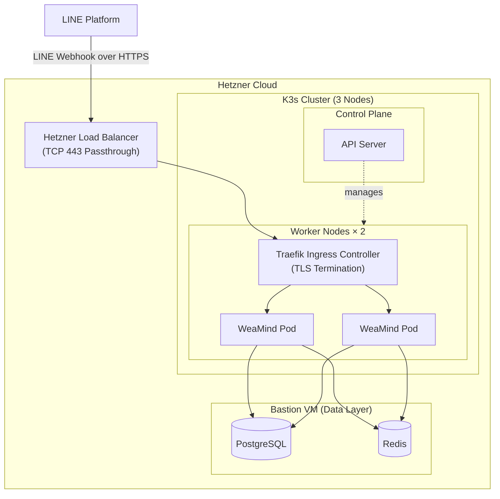

# WeaMind Infrastructure

> Kubernetes infrastructure for WeaMind — a complete migration from single-server Docker Compose to a K8s cluster.

| 📖 中文版 | 🚀 App Repo | 📝 Blog Posts |
| --- | --- | --- |
| [README.md](README.md) | [WeaMind](https://github.com/kyomind/WeaMind) | [blogs/](https://github.com/kyomind/WeaMind/blob/main/blogs/README.md) |

## Architecture

**Architecture summary**:
- **Hybrid runtime**: The application layer runs on K8s while the data layer stays on the bastion VM, connected through Hetzner Private Network.
- **Ingress and cutover model**: Hetzner Load Balancer handles the public entry, Traefik terminates TLS inside the cluster, and traffic is switched between K8s and the single-server environment through the LINE webhook URL.

## Tech Stack

This repository covers the runtime infrastructure stack, observability tooling, and Terraform-based IaC work.

- **K3s** cluster (1 control plane + 2 worker nodes) on Hetzner Cloud
- **Traefik** Ingress Controller (bundled with K3s)
- **Hetzner Load Balancer**
- **cert-manager** + Let's Encrypt (Cloudflare DNS-01 challenge)
- **PostgreSQL** and **Redis** on the bastion VM
- **Helm** + **kube-prometheus-stack** (Prometheus / Grafana observability)
- **Terraform** on GCP Free Tier for IaC experiments

## Deployment Overview

1. **K3s cluster setup**: Install K3s server on the control plane, join worker nodes via node-token, and bind the cluster to the private network interface during setup.
2. **Traefik configuration**: Ensure the built-in Ingress Controller binds to the private network.
3. **cert-manager installation**: Deploy cert-manager + ClusterIssuer (Cloudflare DNS-01).
4. **Application deployment**: Apply the YAMLs in `manifests/` in order — Namespace → ConfigMap → Secret → Deployment → Service → Ingress.
5. **Public entry setup**: Configure the Hetzner Load Balancer for TCP 443 forwarding and health checks, then point Cloudflare DNS to the LB public IP.
6. **Traffic switch**: Update the LINE Developers webhook URL to cut traffic over from `api.kyomind.tw` to `k8s.kyomind.tw`.

For detailed implementation progress and lessons learned, see [PROGRESS.md](PROGRESS.md).

## Design Decisions

### K3s over kubeadm

Single binary, built-in Traefik, CNCF-certified. For a small cluster maintained by a single person, it's the most pragmatic choice.

### Data layer on VM

PostgreSQL and Redis connect to the K8s cluster over a private network. Keeping the data layer on a VM prioritizes stability and avoids the operational overhead of StatefulSets.

### cert-manager + DNS-01

Hetzner's managed certificates don't support Cloudflare DNS, so cert-manager with DNS-01 validation is used instead. The Hetzner Load Balancer handles TCP 443 passthrough only; TLS termination happens at Traefik.

### LINE Webhook URL switching

Takes effect in seconds with no DNS propagation delay. K8s and single-server environments can run in parallel, making testing and rollback straightforward.

## Related Resources

- **Main application**: [WeaMind](https://github.com/kyomind/weamind) — LINE Bot FastAPI application
- **DeepWiki docs**: [deepwiki.com/kyomind/weamind-infra](https://deepwiki.com/kyomind/weamind-infra)
- **Project article**: [WeaMind project walkthrough (Chinese)](https://blog.kyomind.tw/weamind/)
