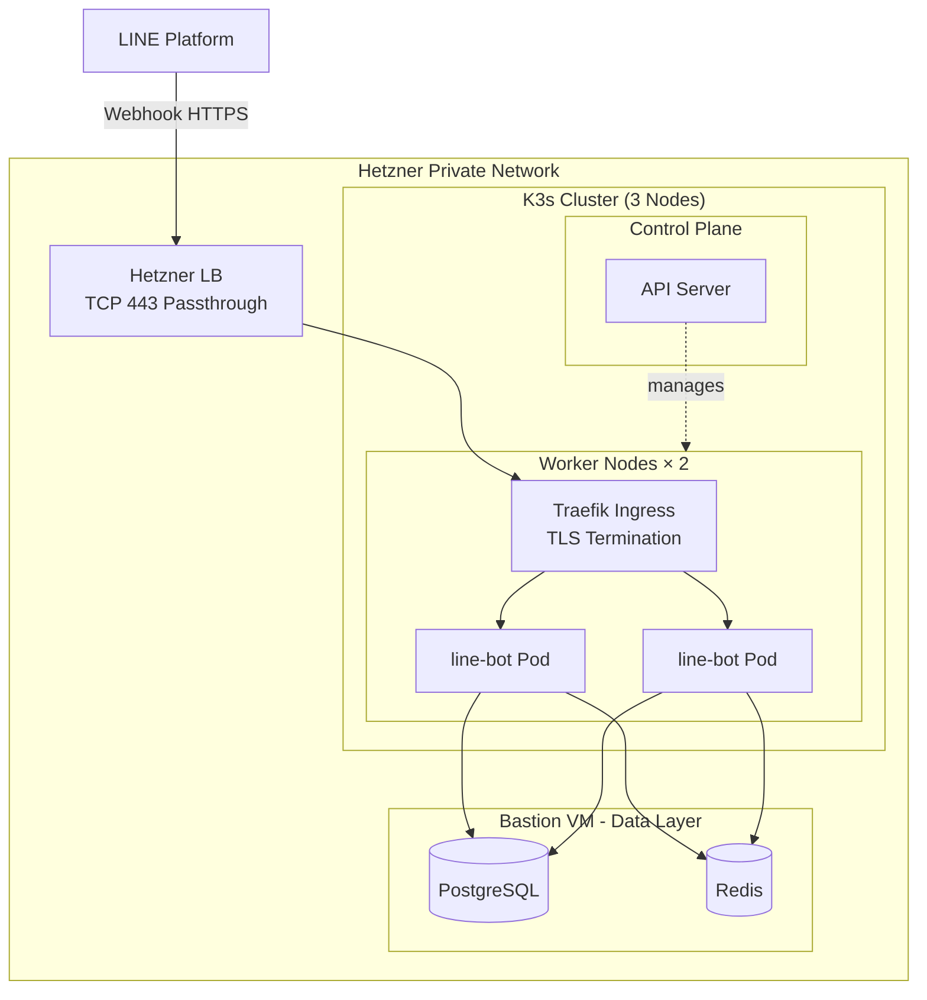

# weamind-infra

Kubernetes manifests for [WeaMind](https://github.com/kyomind/weamind) LINE Bot.

## Stack

- **K3s** (1 control-plane + 2 workers) on Hetzner Cloud
- **Traefik** Ingress Controller (K3s built-in)
- **Hetzner Load Balancer** for traffic distribution
- **cert-manager** + Let's Encrypt (Cloudflare DNS-01) for TLS
- **PostgreSQL** & **Redis** on bastion VM (not in K8s)

## Architecture

- **混合架構**：僅應用層在 K8s，資料庫保留在保壘機（內網連接）
- **獨立端點**：`k8s.kyomind.tw` (K8s) vs `api.kyomind.tw` (單機)
- **流量切換**：透過 LINE webhook URL 切換

## Related Repositories

- [WeaMind](https://github.com/kyomind/weamind) - LINE Bot FastAPI application
